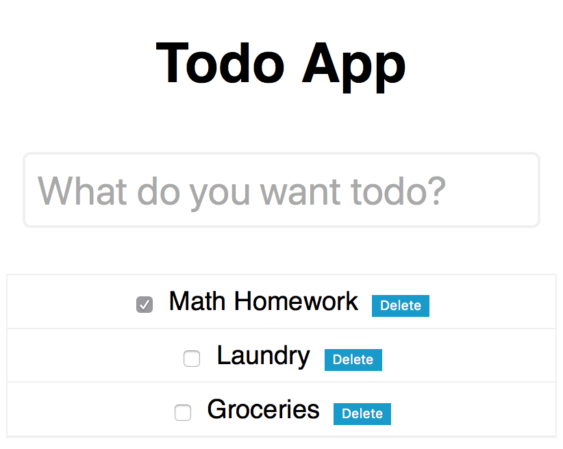

# First ReasonML React project

## Motivation

After having learned Redux & React/React Native and having worked in that environment for over a year I have decided to venture into learning ReasonML to enable me to write type safe JavaScript code.

## Resources Used

- [Reason Scripts](https://github.com/reasonml-community/reason-scripts) - create-react-app for ReasonML 

- [Building a Todo Application with ReasonML](https://www.youtube.com/watch?v=KOSjVDKmwFw)

- [A ReasonReact Tutorial](https://jaredforsyth.com/posts/a-reason-react-tutorial/)

## Screenshots

